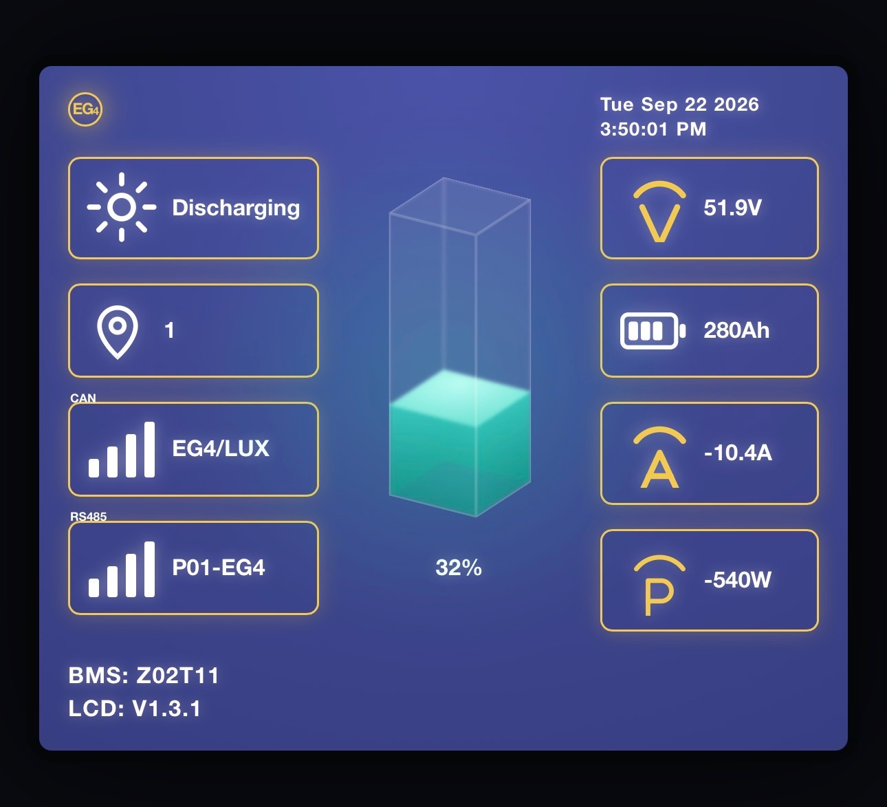

# EG4 Battery Monitor

This is a Linux Only EG4 CAN Bus Battery Monitor for the ARM64 platform.  
The look and feel of the application is inspired by the EG4 Battery Monitor on the battery.  

### Software 
The software is written in Go and uses system level calls to the serial devices to communicate with the EG4 Battery.  
Due to the nature of the how the application uses the serial communication, the application does not require any third party software drivers to be installed. 
The software is lightweight and efficient to where you can run it easily on a PI Zero 2W 

### Tested Hardware 

The software has been tested on the following hardware: 

Compute Boards
- Raspberry Pi 5
- Raspberry Pi Zero W  

Should work on all ARM64 devices with a serial port and a CAN Bus interface. 

CAN Adapters

- Waveshare   [USB-CAN-A](https://www.waveshare.com/usb-can-a.htm?srsltid=AU7gw4XLsG0E8ld7FGMYJiNxbQw2h6UU_ucsldxAkS6mhmqfwa2i8sbC) SKU: 23635  

### Hardware requirements and setup

### Software Installation

#### Compiling from source

#### Installing from deblin package

 

